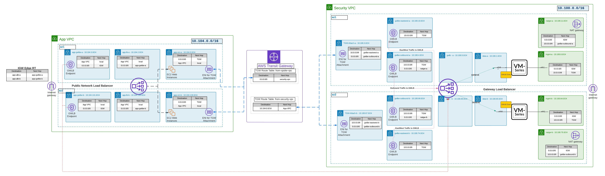

# VM-Series in the Centralized Design Combined Inbound Architecture

Deployment of Palo Alto Networks VM-Series into a variation on one of its [Reference Architectures](https://pandocs.tech/fw/110p-prime): the *Centralized* design using *Combined Inbound Security*.

In a nutshell it means:

- A single Security VPC can protect multiple Application VPCs. Therefore these form the hub and spokes model,
  where the Security VPC is the hub and the Application VPCs are the spokes.
- This case is simplified to a single App1 VPC, but readily extendedable to multiple Application VPCs.
- The outbound dataplane traffic traverses the transit gateway (TGW) and the gateway load balancer (GWLB).
- The outbound dataplane traffic traverses a _single_ interface per each VM-Series, so it is in intrazone category
  instead of interzone. There is no overlay routing on VM-Series. This is a slight departure from the Reference Architecture.
  (It is called a one-arm mode in AWS docs.)
- The inbound dataplane traffic _does not_ traverse TGW and only traverses GWLB. It is also intrazone, in the same manner
  as the outbound traffic.

  VM-Series instances are bootstrapped using S3 bucket based method.

## Topology diagram



## Running the example

To run this Terraform example copy the `example.tfvars` to `terraform.tfvars` and adjust it to your needs.

All Firewall VMs will be set up with an SSH key. There are two ways to approach this:

- use an existing AWS Key Pair - in this case fill out the `ssh_key_name` property with existing Key Pair name
- create a Key Pair with Terraform - for this you will need to adjust the follwing properties:
  - `create_ssh_key` - set it to `true` to trigger Key Pair creation
  - `ssh_key_name` - a name of the newly created Key Pair
  - `ssh_public_key_file` - path to an SSH public key that will be used to create a Key Pair

A thing worth noticing is the Gateway Load Balancer (GWLB) configuration. AWS recommends that GWLB is set up in every Availability Zone available in a particular region. This example is set up for `us-east-1` which has (at the time of writing) zones from `a` to `f`. When changing the region to one that has a different number of Availability Zones, make sure you adjust the GWLB set up accordingly. You can do it in the `security_vpc_subnets` property - add od remove subnets for the `gwlb` set.

When `terraform.tfvars` is ready, run the following commands:

```
terraform init
terraform apply
```

To cleanup the infrastructure run:

```
terraform destroy
```

<!-- BEGINNING OF PRE-COMMIT-TERRAFORM DOCS HOOK -->
## Requirements

| Name | Version |
|------|---------|
| <a name="requirement_terraform"></a> [terraform](#requirement\_terraform) | >= 1.0.0, < 2.0.0 |
| <a name="requirement_aws"></a> [aws](#requirement\_aws) | ~> 4.25 |

## Providers

| Name | Version |
|------|---------|
| <a name="provider_aws"></a> [aws](#provider\_aws) | ~> 4.25 |

## Modules

| Name | Source | Version |
|------|--------|---------|
| <a name="module_app1_gwlbe_inbound"></a> [app1\_gwlbe\_inbound](#module\_app1\_gwlbe\_inbound) | ../../modules/gwlb_endpoint_set | n/a |
| <a name="module_app1_lb"></a> [app1\_lb](#module\_app1\_lb) | ../../modules/nlb | n/a |
| <a name="module_app1_route"></a> [app1\_route](#module\_app1\_route) | ../../modules/vpc_route | n/a |
| <a name="module_app1_subnet_sets"></a> [app1\_subnet\_sets](#module\_app1\_subnet\_sets) | ../../modules/subnet_set | n/a |
| <a name="module_app1_transit_gateway_attachment"></a> [app1\_transit\_gateway\_attachment](#module\_app1\_transit\_gateway\_attachment) | ../../modules/transit_gateway_attachment | n/a |
| <a name="module_app1_vpc"></a> [app1\_vpc](#module\_app1\_vpc) | ../../modules/vpc | n/a |
| <a name="module_bootstrap"></a> [bootstrap](#module\_bootstrap) | ../../modules/bootstrap | n/a |
| <a name="module_gwlbe_eastwest"></a> [gwlbe\_eastwest](#module\_gwlbe\_eastwest) | ../../modules/gwlb_endpoint_set | n/a |
| <a name="module_gwlbe_outbound"></a> [gwlbe\_outbound](#module\_gwlbe\_outbound) | ../../modules/gwlb_endpoint_set | n/a |
| <a name="module_natgw_set"></a> [natgw\_set](#module\_natgw\_set) | ../../modules/nat_gateway_set | n/a |
| <a name="module_security_gwlb"></a> [security\_gwlb](#module\_security\_gwlb) | ../../modules/gwlb | n/a |
| <a name="module_security_subnet_sets"></a> [security\_subnet\_sets](#module\_security\_subnet\_sets) | ../../modules/subnet_set | n/a |
| <a name="module_security_transit_gateway_attachment"></a> [security\_transit\_gateway\_attachment](#module\_security\_transit\_gateway\_attachment) | ../../modules/transit_gateway_attachment | n/a |
| <a name="module_security_vpc"></a> [security\_vpc](#module\_security\_vpc) | ../../modules/vpc | n/a |
| <a name="module_security_vpc_routes"></a> [security\_vpc\_routes](#module\_security\_vpc\_routes) | ../../modules/vpc_route | n/a |
| <a name="module_transit_gateway"></a> [transit\_gateway](#module\_transit\_gateway) | ../../modules/transit_gateway | n/a |
| <a name="module_vmseries"></a> [vmseries](#module\_vmseries) | ../../modules/vmseries | n/a |

## Resources

| Name | Type |
|------|------|
| [aws_ec2_transit_gateway_route.from_spokes_to_security](https://registry.terraform.io/providers/hashicorp/aws/latest/docs/resources/ec2_transit_gateway_route) | resource |
| [aws_instance.app1_vm](https://registry.terraform.io/providers/hashicorp/aws/latest/docs/resources/instance) | resource |
| [aws_ami.this](https://registry.terraform.io/providers/hashicorp/aws/latest/docs/data-sources/ami) | data source |

## Inputs

| Name | Description | Type | Default | Required |
|------|-------------|------|---------|:--------:|
| <a name="input_app1_gwlb_endpoint_set_name"></a> [app1\_gwlb\_endpoint\_set\_name](#input\_app1\_gwlb\_endpoint\_set\_name) | The name of the GWLB VPC Endpoint created to inspect traffic inbound from Internet to the App1 load balancer. | `string` | n/a | yes |
| <a name="input_app1_transit_gateway_attachment_name"></a> [app1\_transit\_gateway\_attachment\_name](#input\_app1\_transit\_gateway\_attachment\_name) | The name of the TGW Attachment to be created inside the App1 VPC. | `string` | n/a | yes |
| <a name="input_app1_vm_type"></a> [app1\_vm\_type](#input\_app1\_vm\_type) | EC2 type for "app1" VMs. | `string` | `"t2.micro"` | no |
| <a name="input_app1_vms"></a> [app1\_vms](#input\_app1\_vms) | Definition of an example "app1" application VMs. They are based on the latest version of Bitnami's NGINX image.<br>The structure of this map is similar to the one defining VM-Series, only one property is supported though: the Availability Zone the VM should be placed in.<br>Example:<pre>app_vms = {<br>  "appvm01" = { az = "us-east-1b" }<br>  "appvm02" = { az = "us-east-1a" }<br>}</pre> | `map(any)` | n/a | yes |
| <a name="input_app1_vpc_cidr"></a> [app1\_vpc\_cidr](#input\_app1\_vpc\_cidr) | The primary IPv4 CIDR of the created App1 VPC. | `string` | n/a | yes |
| <a name="input_app1_vpc_name"></a> [app1\_vpc\_name](#input\_app1\_vpc\_name) | The name tag of the created App1 VPC. | `string` | n/a | yes |
| <a name="input_app1_vpc_security_groups"></a> [app1\_vpc\_security\_groups](#input\_app1\_vpc\_security\_groups) | n/a | `any` | n/a | yes |
| <a name="input_app1_vpc_subnets"></a> [app1\_vpc\_subnets](#input\_app1\_vpc\_subnets) | n/a | `any` | n/a | yes |
| <a name="input_create_ssh_key"></a> [create\_ssh\_key](#input\_create\_ssh\_key) | n/a | `bool` | `false` | no |
| <a name="input_global_tags"></a> [global\_tags](#input\_global\_tags) | n/a | `any` | n/a | yes |
| <a name="input_gwlb_endpoint_set_eastwest_name"></a> [gwlb\_endpoint\_set\_eastwest\_name](#input\_gwlb\_endpoint\_set\_eastwest\_name) | n/a | `any` | n/a | yes |
| <a name="input_gwlb_endpoint_set_outbound_name"></a> [gwlb\_endpoint\_set\_outbound\_name](#input\_gwlb\_endpoint\_set\_outbound\_name) | n/a | `any` | n/a | yes |
| <a name="input_gwlb_name"></a> [gwlb\_name](#input\_gwlb\_name) | n/a | `any` | n/a | yes |
| <a name="input_name"></a> [name](#input\_name) | ## General | `any` | n/a | yes |
| <a name="input_name_prefix"></a> [name\_prefix](#input\_name\_prefix) | n/a | `any` | n/a | yes |
| <a name="input_nat_gateway_name"></a> [nat\_gateway\_name](#input\_nat\_gateway\_name) | n/a | `any` | n/a | yes |
| <a name="input_region"></a> [region](#input\_region) | ## AWS Provider Authentication and Attributes | `any` | n/a | yes |
| <a name="input_security_gwlb_service_name"></a> [security\_gwlb\_service\_name](#input\_security\_gwlb\_service\_name) | Optional Service Name of the pre-existing GWLB which should receive traffic from `app1_gwlb_endpoint_set_name`.<br>If empty or null, instead use the Service Name of the default GWLB named `gwlb_name`.<br>Example: "com.amazonaws.vpce.us-west-2.vpce-svc-0123". | `string` | `""` | no |
| <a name="input_security_vpc_cidr"></a> [security\_vpc\_cidr](#input\_security\_vpc\_cidr) | n/a | `any` | n/a | yes |
| <a name="input_security_vpc_mgmt_routes_to_tgw"></a> [security\_vpc\_mgmt\_routes\_to\_tgw](#input\_security\_vpc\_mgmt\_routes\_to\_tgw) | The eastwest inspection of traffic heading to VM-Series management interface is not possible. <br>Due to AWS own limitations, anything from the TGW destined for the management interface could *not* possibly override LocalVPC route. <br>Henceforth no management routes go back to gwlbe\_eastwest. | `list(string)` | n/a | yes |
| <a name="input_security_vpc_name"></a> [security\_vpc\_name](#input\_security\_vpc\_name) | ## Security VPC | `any` | n/a | yes |
| <a name="input_security_vpc_routes_eastwest_cidrs"></a> [security\_vpc\_routes\_eastwest\_cidrs](#input\_security\_vpc\_routes\_eastwest\_cidrs) | From the perspective of Security VPC, the source addresses of packets coming from TGW and flowing back to TGW. <br>A list of strings, for example `[\"10.0.0.0/8\"]`. | `list(string)` | n/a | yes |
| <a name="input_security_vpc_routes_outbound_destin_cidrs"></a> [security\_vpc\_routes\_outbound\_destin\_cidrs](#input\_security\_vpc\_routes\_outbound\_destin\_cidrs) | From the perspective of Security VPC, the destination addresses of packets coming from TGW and flowing outside. <br>A list of strings, for example `[\"0.0.0.0/0\"]`. | `list(string)` | n/a | yes |
| <a name="input_security_vpc_routes_outbound_source_cidrs"></a> [security\_vpc\_routes\_outbound\_source\_cidrs](#input\_security\_vpc\_routes\_outbound\_source\_cidrs) | From the perspective of Security VPC, the source addresses of packets coming from TGW and flowing outside.<br>Used for return traffic routes post-inspection. <br>A list of strings, for example `[\"10.0.0.0/8\"]`. | `list(string)` | n/a | yes |
| <a name="input_security_vpc_security_groups"></a> [security\_vpc\_security\_groups](#input\_security\_vpc\_security\_groups) | n/a | `any` | n/a | yes |
| <a name="input_security_vpc_subnets"></a> [security\_vpc\_subnets](#input\_security\_vpc\_subnets) | n/a | `any` | n/a | yes |
| <a name="input_security_vpc_tgw_attachment_name"></a> [security\_vpc\_tgw\_attachment\_name](#input\_security\_vpc\_tgw\_attachment\_name) | n/a | `any` | n/a | yes |
| <a name="input_ssh_key_name"></a> [ssh\_key\_name](#input\_ssh\_key\_name) | n/a | `any` | n/a | yes |
| <a name="input_ssh_public_key_file"></a> [ssh\_public\_key\_file](#input\_ssh\_public\_key\_file) | n/a | `any` | `null` | no |
| <a name="input_transit_gateway_asn"></a> [transit\_gateway\_asn](#input\_transit\_gateway\_asn) | Private Autonomous System Number (ASN) of the Transit Gateway for the Amazon side of a BGP session.<br>The range is 64512 to 65534 for 16-bit ASNs and 4200000000 to 4294967294 for 32-bit ASNs. | `number` | n/a | yes |
| <a name="input_transit_gateway_name"></a> [transit\_gateway\_name](#input\_transit\_gateway\_name) | The name tag of the created Transit Gateway. | `string` | n/a | yes |
| <a name="input_transit_gateway_route_tables"></a> [transit\_gateway\_route\_tables](#input\_transit\_gateway\_route\_tables) | Complex input with the Route Tables of the Transit Gateway. Example:<pre>{<br>  "from_security_vpc" = {<br>    create = true<br>    name   = "myrt1"<br>  }<br>  "from_spoke_vpc" = {<br>    create = true<br>    name   = "myrt2"<br>  }<br>}</pre>Two keys are required:<br><br>- from\_security\_vpc describes which route table routes the traffic coming from the Security VPC,<br>- from\_spoke\_vpc describes which route table routes the traffic coming from the Spoke (App1) VPC.<br><br>Each of these entries can specify `create = true` which creates a new RT with a `name`.<br>With `create = false` the pre-existing RT named `name` is used. | `any` | n/a | yes |
| <a name="input_vmseries"></a> [vmseries](#input\_vmseries) | ## VM-Series | `any` | n/a | yes |
| <a name="input_vmseries_common"></a> [vmseries\_common](#input\_vmseries\_common) | n/a | `any` | n/a | yes |
| <a name="input_vmseries_version"></a> [vmseries\_version](#input\_vmseries\_version) | n/a | `any` | n/a | yes |

## Outputs

| Name | Description |
|------|-------------|
| <a name="output_app1_inspected_dns_name"></a> [app1\_inspected\_dns\_name](#output\_app1\_inspected\_dns\_name) | FQDN of "app1" Internal Load Balancer.<br>Can be used in VM-Series configuration to balance traffic between the application instances. |
| <a name="output_security_gwlb_service_name"></a> [security\_gwlb\_service\_name](#output\_security\_gwlb\_service\_name) | The AWS Service Name of the created GWLB, which is suitable to use for subsequent VPC Endpoints. |
| <a name="output_vmseries_public_ips"></a> [vmseries\_public\_ips](#output\_vmseries\_public\_ips) | Map of public IPs created within `vmseries` module instances. |

## Traffic Validation

If no errors occurred during deployment, configure the `vm-series` machines as expected.
- Configure the `data` interface so that GWLB Health Checks work properly.
- All data interfaces should use DHCP
- Create subinterfaces for `Inbound`, `Outbound` and `EastWest` traffic
- Create appropriate zones that will be assigned to the correct subinterfaces
- Create a `Deny All` rule at the very end of the rule list to eliminate unwanted traffic to the environment (In the default configuration, due to the fact that we use subinterfaces, each traffic is seen as an `intrazone`)
- Create policies as needed
- Make sure GWLB sees all `vm-series` in the target group as healthy
- Take the NLB address and see if we are able to get the welcome page from the test app
- Make sure all traffic is visible in the `monitor` tab in `vm-series` (check if the traffic works as expected, if it goes to the right policies)
<!-- END OF PRE-COMMIT-TERRAFORM DOCS HOOK -->
