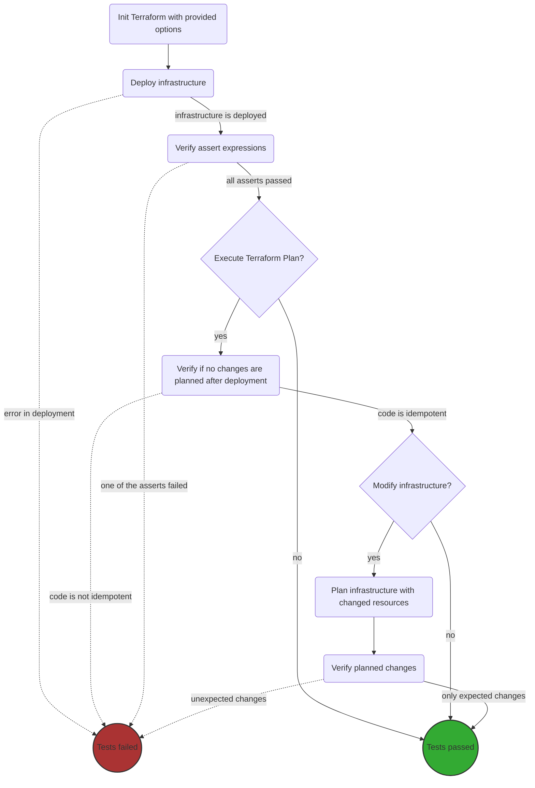

# Quick start

## How to execute tests

Testing Terraform modules:
1. Install required binaries:
    * Terraform at the specific version that you'd like to test: https://developer.hashicorp.com/terraform
    * Go at the latest 1.* version: https://golang.org/
2. Configuration authentication settings e.g. use https://github.com/Nike-Inc/gimme-aws-creds or set ``AWS_REGION`` environment variable and also ``AWS_ACCESS_KEY_ID``, ``AWS_SECRET_ACCESS_KEY``, or similar.
3. Get ``terratest`` package by running command:
```bash
go get -u github.com/gruntwork-io/terratest
```
4. Execute test for module using commands e.g for ``bootstrap`` module:
```bash
cd tests/bootstrap
go test -v -timeout 30m -count=1
```

Run all test:

```bash
go test -timeout 130m ./... -json | go-test-report
```
Comments:
* Do not however run `go test -v .` or similar. Specifying a package (that extra dot) enables caching, which is incompatible with Terraform.
* We use go-test-report to create html reports for tests, check https://github.com/vakenbolt/go-test-report for more information
* Cloud resources are destroyed automatically after the test, no cleanup is normally required.
* VScode users should keep `Go: Test On Save` at the default false value, and not set to true. This option is spelled `go.testOnSave` in settings.json.

## Test skeleton overview

